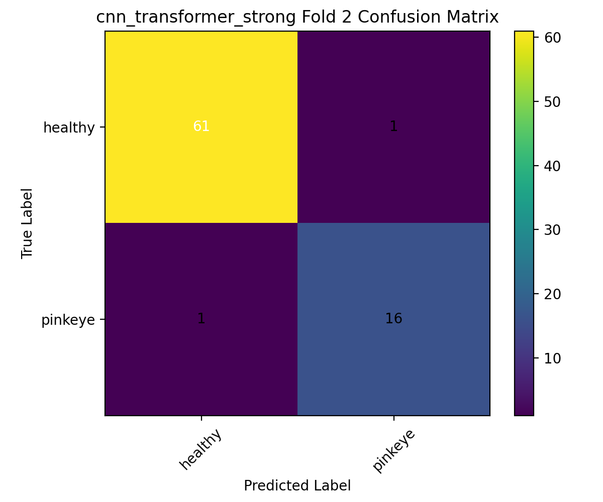

# Step 2 Classification Benchmark Report

**Project:** Cattle Pinkeye Detection - Step 2 (Eye-Crop Classification)  
**Date:** March 13, 2026  
**Dataset root:** `outputs/eye_crops_classification`

---

## 1. Dataset Size

The real cropped-eye dataset used for training and evaluation contains:

- **Total images:** 394
- **healthy (label 0):** 309
- **pink_eye (label 1):** 85

Evaluation protocol:

- **Stratified 5-fold cross-validation**
- Per model: 5 epochs, weighted cross-entropy, early stopping enabled
- GPU benchmark run via `train_step2_benchmark.slurm`

---

## 2. Models and Structure

### Model A - ResNet18

Pipeline:

`Input -> ResNet18 backbone (ImageNet pretrained) -> replaced FC head (2 classes)`

Notes:

- Standard CNN baseline
- Final fully connected layer is replaced for binary classification

### Model B - EfficientNet-B0

Pipeline:

`Input -> EfficientNet-B0 backbone (ImageNet pretrained) -> replaced classifier head (2 classes)`

Notes:

- Stronger CNN baseline with efficient scaling
- Final classifier layer adapted for binary classification

### Model C - CNN + Transformer (baseline hybrid)

Pipeline:

`Input -> CNN backbone feature map -> 1x1 projection -> tokenization -> Transformer encoder -> mean pooling -> linear head`

Notes:

- Lightweight hybrid design
- Uses token mean pooling for final representation

### Model D - Strong CNN + Transformer (new)

Pipeline:

`Input -> CNN feature map -> 1x1 projection -> tokens + CLS token + learnable positional embedding -> Transformer encoder -> CLS output -> MLP head`

Notes:

- Adds a **CLS token** for explicit global representation
- Adds **learnable positional embeddings**
- Uses a stronger multi-layer classification head with dropout
- Intended to improve representation quality on subtle disease cues

---

## 3. Results Comparison (5-fold mean ± std)

| Model | Accuracy | Balanced Acc | Precision | Recall | F1-score | ROC-AUC | Recall_pinkeye | F1_pinkeye |
|---|---:|---:|---:|---:|---:|---:|---:|---:|
| ResNet18 | 0.9569 ± 0.0144 | 0.9342 ± 0.0289 | 0.9094 ± 0.0619 | 0.8941 ± 0.0644 | 0.8992 ± 0.0342 | **0.9867 ± 0.0117** | 0.8941 ± 0.0644 | 0.8992 ± 0.0342 |
| EfficientNet-B0 | 0.9568 ± 0.0114 | **0.9383 ± 0.0297** | 0.8980 ± 0.0393 | **0.9059 ± 0.0671** | 0.9000 ± 0.0279 | 0.9829 ± 0.0122 | **0.9059 ± 0.0671** | 0.9000 ± 0.0279 |
| CNN+Transformer | 0.9239 ± 0.0235 | 0.9132 ± 0.0215 | 0.7934 ± 0.0928 | 0.8941 ± 0.0492 | 0.8369 ± 0.0429 | 0.9681 ± 0.0327 | 0.8941 ± 0.0492 | 0.8369 ± 0.0429 |
| **Strong CNN+Transformer** | **0.9594 ± 0.0106** | 0.9358 ± 0.0229 | **0.9251 ± 0.0795** | 0.8941 ± 0.0644 | **0.9051 ± 0.0214** | 0.9850 ± 0.0024 | 0.8941 ± 0.0644 | **0.9051 ± 0.0214** |

Summary:

- Best overall classification quality: **Strong CNN+Transformer**
- Best pinkeye recall: **EfficientNet-B0**
- Highest ROC-AUC: **ResNet18** (very close to strong hybrid)

---

## 4. Confusion Matrix - Best Model (Strong CNN+Transformer)

Representative confusion matrix figure (Fold 2):

Aggregate confusion counts across all 5 validation folds:

| True \\ Pred | Healthy | Pinkeye |
|---|---:|---:|
| Healthy | 302 | 7 |
| Pinkeye | 9 | 76 |

This corresponds to strong class separation with low false positives and false negatives.

---

## 5. Why `cnn_transformer_strong` Worked Better

`cnn_transformer_strong` likely outperformed the other models due to a better balance of **feature extraction** and **sequence aggregation**:

1. **CLS-token based aggregation**  
   The model learns a dedicated global representation token instead of relying only on mean pooling over all tokens.

2. **Learnable positional embeddings**  
   Positional information is explicitly encoded, helping the transformer preserve spatial structure in eye features.

3. **Stronger classification head**  
   The deeper MLP head (LayerNorm -> Linear -> GELU -> Dropout -> Linear) provides higher capacity for subtle healthy vs pinkeye separation.

4. **CNN + Transformer complementarity**  
   The CNN backbone captures local texture/edge pathology cues, while the transformer captures global context and interactions.

5. **Good precision-recall balance**  
   Compared with baseline hybrid, the strong version improved precision and F1 substantially while keeping strong pinkeye recall.

---

## 6. Output Paths

- ResNet18 metrics: `outputs/benchmark_gpu/resnet18/metrics/`
- EfficientNet-B0 metrics: `outputs/benchmark_gpu/efficientnet/metrics/`
- CNN+Transformer metrics: `outputs/benchmark_gpu/cnn_transformer/metrics/`
- Strong CNN+Transformer metrics: `outputs/benchmark_gpu/cnn_transformer_strong/metrics/`
- Plots (best model): `outputs/benchmark_gpu/cnn_transformer_strong/plots/`
